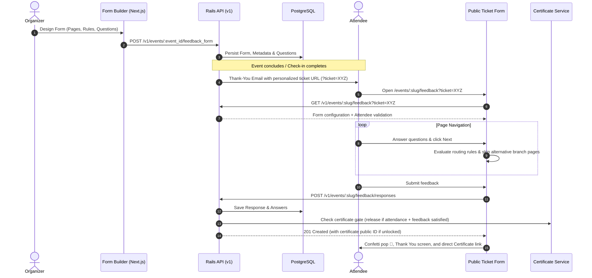

# 📘 EventzFlow Feedback System: Developer Handoff Documentation

> **Status**: Production Ready & Fully Tested  
> **Last Updated**: September 30, 2026  
> **Primary Branches**: `enhance-form-builder` (Panel) / `main` (API)  
> **Target Audience**: Developers, QA Engineers, and Technical Product Managers  

---

## 📑 Table of Contents

1. [Executive Summary](#1-executive-summary)
2. [Architecture & System Flow](#2-architecture--system-flow)
3. [Key Capabilities & Feature Guide](#3-key-capabilities--feature-guide)
   - [Event-Level Gate (`use_feedback`)](#event-level-gate-use_feedback)
   - [Feedback Form Builder](#feedback-form-builder)
   - [Public Attendee Feedback Experience](#public-attendee-feedback-experience)
   - [Analytics & Response Viewer](#analytics--response-viewer)
4. [Database & Schema Reference](#4-database--schema-reference)
5. [Codebase File Inventory](#5-codebase-file-inventory)
6. [Core Algorithms & Business Logic](#6-core-algorithms--business-logic)
   - [Page Navigation & Automatic Branch Skipping](#page-navigation--automatic-branch-skipping)
   - [Reachable Questions Filter](#reachable-questions-filter)
   - [Unsaved Changes Safety & Floating Save Bar](#unsaved-changes-safety--floating-save-bar)
7. [Testing & Verification Guide](#7-testing--verification-guide)
8. [Deployment & Operations Checklist](#8-deployment--operations-checklist)

---

## 1. Executive Summary

The **EventzFlow Feedback System** is a full-stack survey and feedback engine tailored for live and virtual events. It provides organizers with a flexible, multi-page form builder with conditional branch routing, live previews, and response analytics. Attendees receive personalized submission links in their post-event thank-you emails, complete their survey on a vintage perforated ticket stub interface, and immediately unlock their verifiable E-Certificate upon submission.

### Key Highlights
- **100% Feature-Gated**: Organizers can activate or deactivate feedback per event (`events.use_feedback`).
- **Dynamic Multi-Page Stepper & Continuous Scrolling**: Organizers can choose between a page-by-page interactive wizard (with conditional branching) or a continuous single-page scrolling ticket stub.
- **Conditional Skip Logic**: Direct routing based on single-choice answers (e.g. *"Did you attend Track B?"* ➔ If No, skip to Page 4; when completing Page 3, automatically bypass alternative branches).
- **Custom Rating Scales**: 1–5 score customization with built-in presets (Satisfaction, Quality, Agreement) and live inline visual previews.
- **Safety First**: Floating save bar, `beforeunload` warnings, in-app navigation interceptors, and modal confirmation dialogs when deleting non-empty questions or sections.

---

## 2. Architecture & System Flow



---

## 3. Key Capabilities & Feature Guide

### Event-Level Gate (`use_feedback`)
- Located in: `Event Settings` ➔ `Advanced Options` ➔ `Feedback Form` toggle.
- When disabled:
  - Feedback menu items in the sidebar (`Form Builder`, `Responses`) are hidden.
  - Direct URL access to `/event/[id]/feedback/*` renders a `<FeatureLockedState />` banner guiding the user to turn the feature on in settings.
- Backend enforcement: Whitelisted `:use_feedback` parameter in `EventsController#event_params` and exposed in `SIDEBAR_EVENT_FIELDS`.

### Feedback Form Builder
Accessible at `/event/[event_id]/feedback/form-builder`:
1. **Direct Form Info**: Title and Description inputs are directly presented at the top.
2. **Accepting Responses Switch**: Active switch displays in emerald green; deactivated switch displays in red/muted with instant status clarity.
3. **Display Modes**:
   - **Flipping Pages (Stepper)**: Page-by-page flow with navigation buttons and condition routing.
   - **Continuous Scrolling**: All sections stacked vertically on a single ticket stub.
4. **Questions Management**:
   - Input is positioned directly alongside the question number index (`01`, `02`).
   - Answer types: **Rating (1–5)**, **Text**, **Single Choice**, **Multi Choice**, **Yes / No**.
   - Expandable **"+ Add description"** button for subtitle/hint text.
   - Text questions feature a customizable placeholder input.
   - Inline live preview renders exactly what attendees will see.
5. **Multi-Page Organization**:
   - Pages can be added, deleted, or reordered.
   - Questions can be moved within a page (Up/Down) or transferred across pages via the "Move" menu.
   - Deleting a page automatically re-assigns its questions to the previous page and prompts for confirmation if data exists.
6. **Conditional Branching ("Go to page based on answer")**:
   - Available on Single Choice questions in Flipping Pages mode.
   - Organizers can map any choice to jump to a specific page or trigger instant submission.
   - Prominent **"Set rules"** button with active rule count badge.
7. **Custom Thank You Screen**:
   - Organizers can configure custom post-submission **Heading** and **Message**.
8. **Attendee-Specific Link Generator**:
   - Dedicated search component to look up confirmed attendees by name or email.
   - Generates their unique URL (`?ticket=<public_id>`).
   - Features **"Copy attendee link"** and **"Open in new tab"** buttons to test submissions directly without manual URL manipulation.
9. **Unsaved Changes Protection**:
   - Tracks dirty state across all fields, pages, and questions.
   - Displays a persistent **Floating Save Bar** at the bottom of the viewport with an amber pulse indicator and submit action.
   - Intercepts browser refresh/tab close via `beforeunload`, internal client-side navigation clicks, and browser back/forward history navigation.

### Public Attendee Feedback Experience
Accessible at `/events/[slug]/feedback?ticket=<public_id>`:
- **Perforated Ticket UI**: Features realistic tear-off notches, dashed dividers, and smooth layout animations.
- **Smart Progress Ring**: Visual SVG radial progress ring tracking required question completion.
- **Dual Display Support**:
  - Flipping mode renders page-by-page with smooth slide transitions and dynamic step calculation.
  - Continuous mode renders the entire survey with clean section dividing bars.
- **Branch Skipping Engine**: Automatically recalculates reachable pages when advancing from branched pages, ensuring non-selected alternative branches are completely skipped.
- **Certificate Integration**: If the event has certificates enabled and gates them behind feedback completion, the thank-you screen displays a direct **"View your certificate"** action button.

### Analytics & Response Viewer
Accessible at `/event/[event_id]/feedback/responses`:
- **Summary Tab**:
  - Total response counter and latest submission timestamp.
  - Rating score distribution bars with weighted averages.
  - Choice distribution percentage bars.
  - Real-time text response stream showing recent attendee comments.
- **Individual Responses Tab**:
  - Inspect individual attendee survey tickets.
  - Detailed breakdown of each attendee's answers and timestamp.
- **Exporting**: One-click **Export CSV** for deep offline reporting.

---

## 4. Database & Schema Reference

### `events` Table
| Column | Type | Default | Description |
|---|---|---|---|
| `use_feedback` | `boolean` | `false` | Master event toggle enabling the feedback subsystem |

### `feedback_forms` Table
| Column | Type | Nullable | Description |
|---|---|---|---|
| `event_id` | `bigint (FK)` | No | Parent event reference (1-to-1) |
| `title` | `string` | No | Form title |
| `description` | `text` | Yes | Form subtitle/description |
| `is_active` | `boolean` | No | Controls whether responses are accepted |
| `display_mode` | `integer` | No | Enum: `0: pages` (stepper), `1: continuous` |
| `pages_metadata` | `jsonb` | Yes | Array of page objects `[{ page_number, title, description }]` |
| `thank_you_title` | `string` | Yes | Custom thank-you modal heading |
| `thank_you_message` | `text` | Yes | Custom thank-you modal body copy |

### `feedback_questions` Table
| Column | Type | Nullable | Description |
|---|---|---|---|
| `feedback_form_id` | `bigint (FK)` | No | Parent form reference |
| `question_text` | `text` | No | Primary question prompt |
| `question_type` | `integer` | No | Enum: `0: rating`, `1: text`, `2: single_choice`, `3: multi_choice`, `4: boolean` |
| `options` | `jsonb` | Yes | Array of option strings, or 5 custom label strings for rating |
| `required` | `boolean` | No | Mandatory question flag |
| `position` | `integer` | No | Order of question within form/page |
| `page_number` | `integer` | No | 1-indexed page container assignment (default: `1`) |
| `placeholder` | `string` | Yes | Textarea placeholder prompt |
| `hint_text` | `string` | Yes | Subtitle / guidance text below question prompt |
| `routing_rules` | `jsonb` | Yes | Branch rules `[{ answer: string, action: string, target_page: number | null }]` |

### `feedback_responses` Table
| Column | Type | Nullable | Description |
|---|---|---|---|
| `feedback_form_id` | `bigint (FK)` | No | Parent form reference |
| `ticket_id` | `bigint (FK)` | No | Verified attendee ticket reference (Unique per form) |
| `submitted_at` | `datetime` | No | Timestamp of submission |

### `feedback_answers` Table
| Column | Type | Nullable | Description |
|---|---|---|---|
| `feedback_response_id` | `bigint (FK)` | No | Parent response reference |
| `feedback_question_id` | `bigint (FK)` | No | Parent question reference |
| `answer_text` | `text` | Yes | Answer value for text, rating, single_choice, or boolean |
| `answer_options` | `jsonb` | Yes | Array of selected strings for multi_choice |

---

## 5. Codebase File Inventory

### Frontend (Next.js 16 Panel)
| Path | Purpose |
|---|---|
| [`src/components/pages/feedback-form/feedback-form-builder.tsx`](file:///Users/orsontamin/Code/Jesselton-Pixel/eventzflow/new-eventzflow-panel/src/components/pages/feedback-form/feedback-form-builder.tsx) | Complete organizer form builder with pages, questions, branching, safety guards, and floating save bar |
| [`src/components/pages/feedback-form/attendee-feedback-link.tsx`](file:///Users/orsontamin/Code/Jesselton-Pixel/eventzflow/new-eventzflow-panel/src/components/pages/feedback-form/attendee-feedback-link.tsx) | Attendee search & direct submission URL generator with preview launch button |
| [`src/components/pages/feedback-form/question-live-preview.tsx`](file:///Users/orsontamin/Code/Jesselton-Pixel/eventzflow/new-eventzflow-panel/src/components/pages/feedback-form/question-live-preview.tsx) | Inline visual preview component rendering live question states |
| [`src/components/pages/feedback-form/public-feedback-form.tsx`](file:///Users/orsontamin/Code/Jesselton-Pixel/eventzflow/new-eventzflow-panel/src/components/pages/feedback-form/public-feedback-form.tsx) | Public attendee ticket stub form supporting both Stepper and Continuous modes |
| [`src/components/pages/feedback-form/feedback-responses-viewer.tsx`](file:///Users/orsontamin/Code/Jesselton-Pixel/eventzflow/new-eventzflow-panel/src/components/pages/feedback-form/feedback-responses-viewer.tsx) | Response analytics, rating charts, comments list, and individual attendee answers |
| [`src/lib/feedback-answers.ts`](file:///Users/orsontamin/Code/Jesselton-Pixel/eventzflow/new-eventzflow-panel/src/lib/feedback-answers.ts) | Dynamic evaluation engine for page jumps, history backtracking, and reachable question calculation |
| [`src/lib/api/feedback-form.ts`](file:///Users/orsontamin/Code/Jesselton-Pixel/eventzflow/new-eventzflow-panel/src/lib/api/feedback-form.ts) | API client functions for fetching, creating, updating forms and submitting responses |
| [`src/tests/feedback-answers.test.ts`](file:///Users/orsontamin/Code/Jesselton-Pixel/eventzflow/new-eventzflow-panel/src/tests/feedback-answers.test.ts) | Vitest unit test suite validating branching jumps, alternative branch skipping, and reachability |

### Backend (Rails 8 API)
| Path | Purpose |
|---|---|
| `app/models/feedback_form.rb` | FeedbackForm model with validations, enum `display_mode`, and cascade associations |
| `app/models/feedback_question.rb` | Question model with enums, JSONB serialization for options and routing rules |
| `app/models/feedback_response.rb` | Response model enforcing unique ticket submission constraints |
| `app/models/feedback_answer.rb` | Answer storage supporting scalar values and JSONB multi-choice arrays |
| `app/controllers/v1/feedback_forms_controller.rb` | Form configuration endpoints (show, update, public form lookup) |
| `app/controllers/v1/feedback_responses_controller.rb` | Public submission endpoint with reachable question validation and certificate release |
| `app/serializers/feedback_form_serializer.rb` | JSON serializer for admin and public form presentation |
| `db/migrate/*` | Database migrations for feedback tables and `events.use_feedback` |

---

## 6. Core Algorithms & Business Logic

### Page Navigation & Automatic Branch Skipping
Located in [`src/lib/feedback-answers.ts`](file:///Users/orsontamin/Code/Jesselton-Pixel/eventzflow/new-eventzflow-panel/src/lib/feedback-answers.ts#L45-L95):

When an attendee is on Page $N$ and clicks **Next**:
1. Inspect answers on Page $N$. If a question has a matching `routing_rules` rule for the chosen answer:
   - If action is `"submit"` ➔ Flag for submission.
   - If action is `"jump_to_page"` ➔ Jump directly to `target_page`.
2. If no direct rule fired from Page $N$, calculate the normal next page candidate ($N + 1$).
3. **Alternative Branch Bypass**:
   - Inspect all preceding answered questions that contained branch rules.
   - Gather all alternative targets that were **not** chosen (e.g., choice was "Track A" which jumped to Page 3; "Track B" jumped to Page 4). Page 4 is an *unselected alternative branch*.
   - If candidate page is an unselected alternative branch target, automatically advance to the first page past the branching block (e.g. Page 5).
4. Store the traversed page in a navigation history stack so clicking **Previous** retraces the exact sequence taken.

### Reachable Questions Filter
Located in [`src/lib/feedback-answers.ts`](file:///Users/orsontamin/Code/Jesselton-Pixel/eventzflow/new-eventzflow-panel/src/lib/feedback-answers.ts#L98-L135):
- Evaluates the start-to-finish graph of reachable pages based on the attendee's selected answers.
- Filters questions down to only those on reachable pages.
- Both the frontend progress bar and the backend required-field validation only enforce required checks on reachable questions, preventing submission errors for questions on skipped pages.

### Unsaved Changes Safety & Floating Save Bar
Located in [`src/components/pages/feedback-form/feedback-form-builder.tsx`](file:///Users/orsontamin/Code/Jesselton-Pixel/eventzflow/new-eventzflow-panel/src/components/pages/feedback-form/feedback-form-builder.tsx#L220-L290):
- **Dirty State Tracking**: Deep comparison between initial form state and live component state (`title`, `description`, `isActive`, `displayMode`, `thankYouTitle`, `thankYouMessage`, `pages`, and `questions`).
- **Floating Save Action**: When `isDirty === true`, an action pill with amber indicator renders fixed at the bottom center of the viewport (`z-40`), allowing instant saves regardless of scroll depth.
- **Navigation Guard**:
  - `beforeunload` listener triggers native browser prompt on page refresh or window closure.
  - Capturing phase click listener intercepts internal Next.js `<a>` link navigation clicks and presents a confirmation dialog.
  - `popstate` listener prevents accidental back/forward browser button navigation.

---

## 7. Testing & Verification Guide

### Running Frontend Tests
In `new-eventzflow-panel`:
```bash
# Run unit test suite
pnpm test

# Run tests in watch mode during development
pnpm vitest

# Run linter
pnpm lint
```

### Running Backend Specs
In `eventz_flow_api`:
```bash
# Run feedback-related specs
bundle exec rspec spec/requests/v1/feedback_forms_spec.rb
bundle exec rspec spec/requests/v1/feedback_responses_spec.rb
bundle exec rspec spec/models/feedback_question_spec.rb
```

---

## 8. Deployment & Operations Checklist

When deploying changes to production or staging environments:

1. **Database Migrations**:
   Run Rails migrations in `eventz_flow_api`:
   ```bash
   bin/rails db:migrate
   ```
   Ensure `use_feedback` column is present on `events` and all `feedback_*` tables exist.
2. **Environment & URLs**:
   Verify that frontend public base URL (`NEXT_PUBLIC_APP_URL` or `window.location.origin`) matches the domain used for attendee thank-you emails.
3. **Email Templates**:
   Ensure post-event thank-you email templates include the personalized feedback URL tag:
   `{{ event_feedback_url }}?ticket={{ ticket.public_id }}`.
4. **Certificate Gating**:
   Verify that `CertificateIssueJob` or equivalent issuance worker checks both attendance status (`checked_in: true`) and feedback response presence if `require_feedback` is configured for the certificate template.

---

*Documentation maintained in `docs/feedback-system-handoff.md`. For architectural changes or roadmap extensions, update this file and notify the core development team.*
